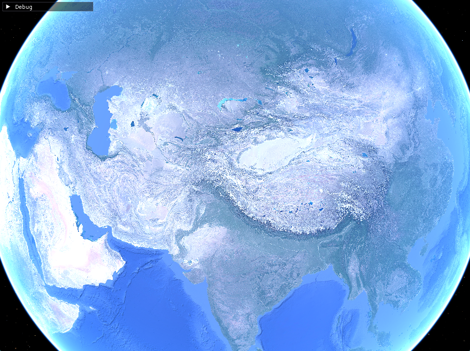
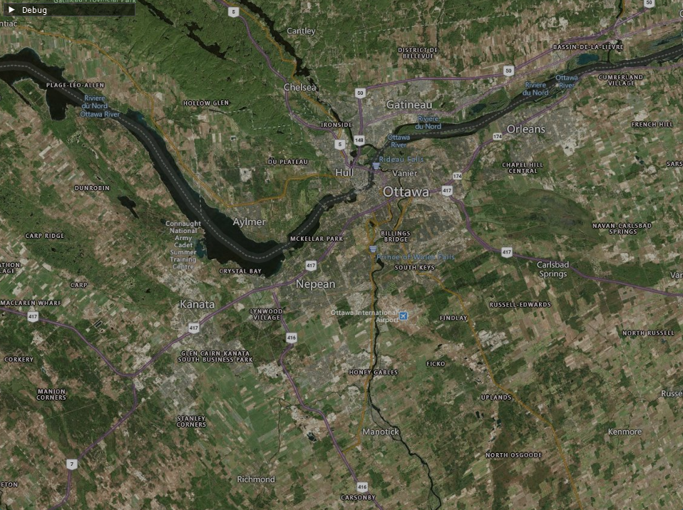
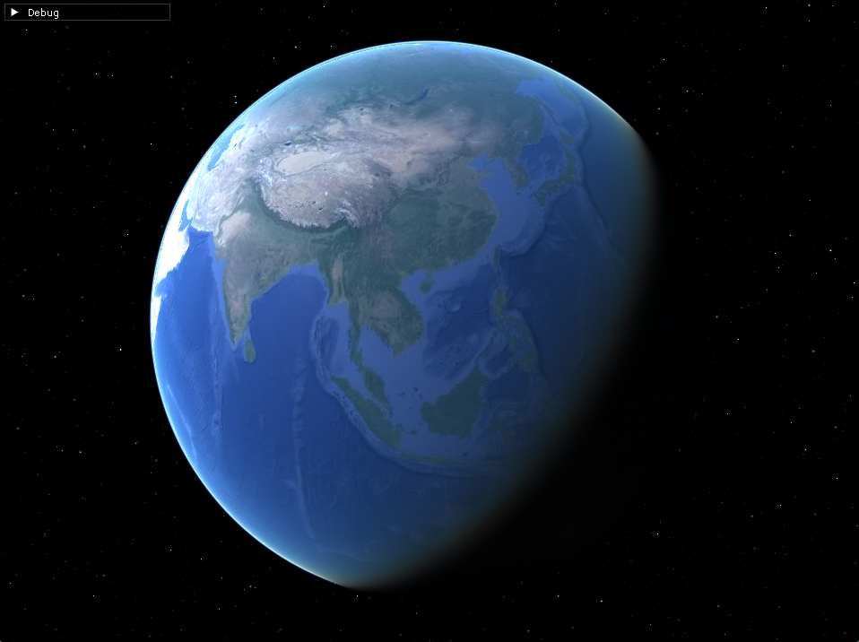
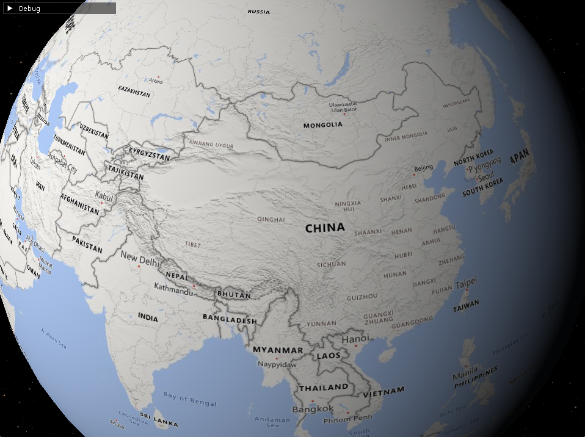
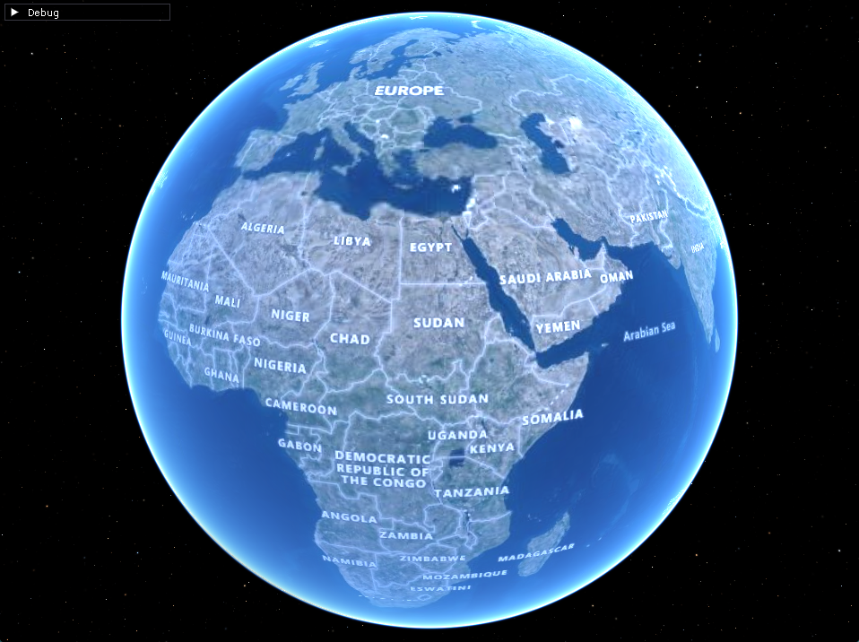
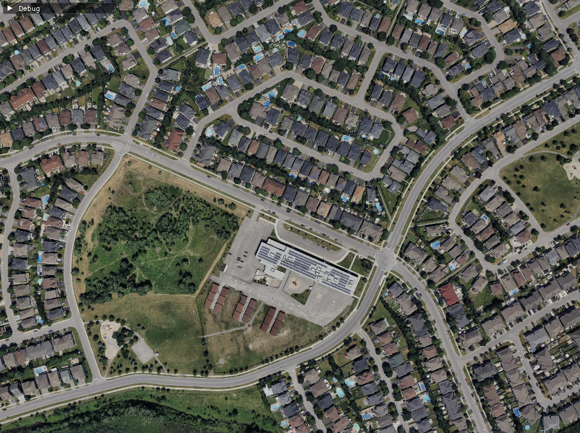

# SDL Earth Viewer








Earth Viewer using SDL3 GPU and Cesium Native

### Features

- Cesium Ion integration
- 3D, terrain, and imagery tiles
- Planetary scale rendering
- Fun shaders

### Limitations

- Only 1 imagery layer is supported

### Cesium Ion

#### Authentication

The project pulls maps from https://api.cesium.com/.
To authenticate with the endpoint:
1. Create an account with [Cesium Ion](https://ion.cesium.com/)
2. Go to [Access Tokens](https://ion.cesium.com/tokens)
3. Copy "Default Token" to your clipboard
4. Create a file called `cesium_ion_token.txt` in your home directory
5. Paste the token in the file

You should see "Successfully refreshed Cesium ion token for URL..." upon launching the executable.

#### Assets

1. Go to [My Assets](https://ion.cesium.com/assets)
2. Specify the maps you'd like to load in ImGui and click "Recreate"
   - For terrain/imagery, use the terrain ID for "Ion Asset ID" and the imagery ID for "Ion Imagery ID"
   - For 3D tiles, use ID for "Ion Asset ID" and `-1` for "Ion Imagery ID"
3. You can grab more maps from [Asset Depot](https://ion.cesium.com/assetdepot) but I haven't tested it much

#### Windows

```bash
git clone https://github.com/jsoulier/sdl_earth_viewer --recurse-submodules
cd sdl_earth_viewer
mkdir build
cd build
cmake ..
cmake --build . --parallel 8 --config Release
cd bin
./sdl_earth_viewer.exe
```

#### Linux

```bash
git clone https://github.com/jsoulier/sdl_earth_viewer --recurse-submodules
cd sdl_earth_viewer
mkdir build
cd build
cmake .. -DCMAKE_BUILD_TYPE=Release
cmake --build . --parallel 8
cd bin
./sdl_earth_viewer
```

#### Shaders

Shaders are precompiled.
To build locally, add [SDL_shadercross](https://github.com/libsdl-org/SDL_shadercross) to your path
